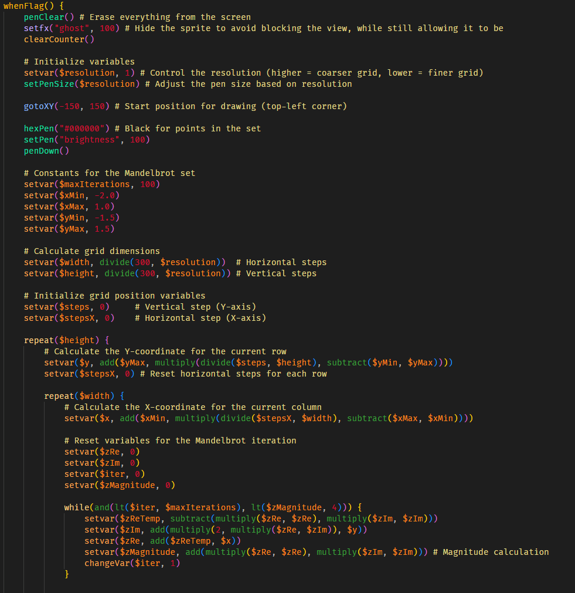

### Notice: This post was transcribed from the [Katnip Scratch Forums](https://scratch.mit.edu/discuss/post/8281569/)

# V.2 ScratchText  (now known as Katnip)

* **V.2 Repository:** [GitHub](https://github.com/B1j2754/katnip)  
* ~~**V.2 VSCode Extension:** [GitHub](https://github.com/B1j2754/syntax-katnip)~~ (post poned until further notice -B1j2754)
* **Wiki:** [GitHub](https://github.com/B1j2754/katnip/wiki)  

## Update 

**Docs/wiki released on GitHub!**  

I don't have much time, but I will release more documentation sometime tomorrow (or this weekend) 😁.  

Tonight, I will go ahead and publish both:  
- The VSCode extension  
- The source code for ScratchText (now Katnip) v.2  

To install the VSCode extension, drag and drop `syntax-katnip` into:  
`C:/Users/YourName/.vscode/extensions/` and reload VSCode.  


## Running the Project  

To run anything, execute:  

```sh
python src/run.py
```

## Examples

There also is a handful of projects written in the project (see `/scripts/`) and you can look through how the code works!

## See y'all this weekend with a bigger update!

<sup>any guesses for what this does? 🤔</sup>
